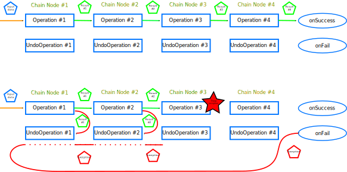

# Operation Chain
A simple library for creating a chain of operations. 
The main benefit of using this library is the ability to declare undo operations if any operation in chain fails.


## How this work?


`Operation Chain` consists of `Operation Nodes`. Operation Node hold `Operation Function`, 
will be called if the previous node executed correctly or the node is the first in the chain. 
When `Operation Function` throw an exception, it is considered a node failure.
To `Operation Function` will be given result of previous node and result of this `Operation Function` will be send to 
next node.
Also, a node can have an `Undo Function` that will be called when any of the next nodes in the chain fail.
To `Undo Function` will be given result of `Operation Function` from same node that undo function.

`Operation Chain` can be ended `On Success` function and `On Fail` function. `On Success` will be called when all
nodes succeed. To `On Success` will be given result of last node. `On Fail` will be triggered when one of nodes failed.
To `On Fail` function will be given `Throwable` thrown by a failed node.

## How use this?
Let's assume that we have a large distributed system where creating a new user requires performing many operations

### Scenario for adding a new user:
1. Validation of input data
2. Creating a new account on the authentication service
3. Creating a new account on the git server
4. Creating a new account on the jira service
5. Creating a new account on mail service
6. send emails

Each stage may fail for any reason. We should take care to clean up the changes we have made.
Without keeping the code clean, we can end up with complicated `try catch` or `callback hell` nesting.
Adding a new stage may also prove cumbersome and error-prone.

### What might this look like using `Operation Chain`?
```java
    //Create a chain when initiating the application
    OperationChain<CreateUserRequest, ?> createUserOperationChain = OperationChain
            .start(this::createAuthenticationAccount, this::removeAuthenticationAccout)
            .next(this::createGitAccount, this::removeGitAccount)
            .next(this::createJiraAccount, this::removeJiraAccount)
            .next(this::createMainAccount, this::removeMailAccount)
            .next(this::sendMailToNewUser)
            .createChain(this::onSuccess, this::onFail);
    ...
        
    //call chain when needed
    createUserOperationChain.process(createUserRequest);
```

This looks neat and is easy to follow the order of calls